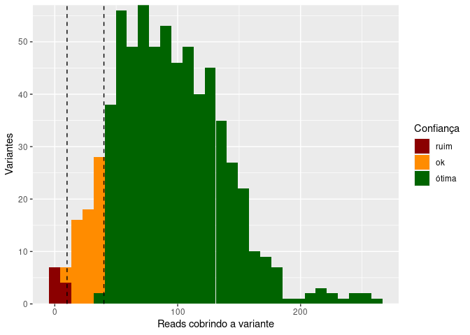
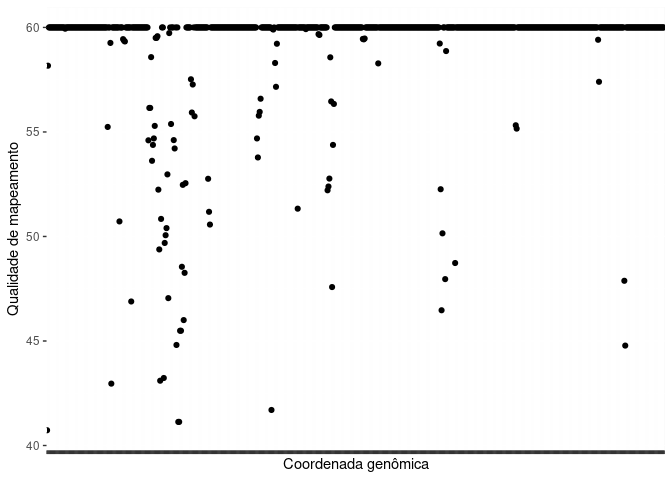

### Questão 1:

*Quais variantes deverão ser desconsideradas no seu VCF?* *Qualquer
métrica do software de escolha poderá ser utilizada. Discorra sobre a
métrica utilizada. Mandar o vcf filtrado*

**Resposta: No Dia 1, variantes que não passaram por filtros mínimos de
qualidade recomendados pelo GATK (links abaixo) tais como qualidade de
mapeamento (MQ), viés de alinhamento em uma determinada fita de DNA (FS
e SOR), dentre outros, foram eliminadas. Hoje, variantes em regiões não
cobertas pelo arquivo .bed foram excluídas utilizando a ferramenta
bedtools (filterVCF.sh)**  
**A métrica MQ quantifica a qualidade de mapeamento de uma leitura em
uma região genômica, um alto MQ assegura uma confiança no mapeamento das
leituras que suportam determinada variante**  
**Métricas como FS e SOR estão relacionadas ao viés de alinhamento de
reads em uma determinada fita de DNA, positiva ou negativa. Espera-se
que a distribuição do alinhamento das leituras seja similar entre as
fitas. Uma preferência elevada pela fita positiva ou negativa pode
indicar viés do sequenciamento, como uma baixa qualidade da base
sequenciada.**  
**A métrica DP representa o número de reads totais que suportam a
variante, ou seja, que mapeiam na região que a variante foi
identificada. Algumas variantes apresentaram valores de DP=2, o que
representam duas reads mapeando na região da variante. Caso uma dessas
leituras não estivesse presente a variante nem seria detectada. A maior
confiabilidade da variante está relacionada a valores superiores a um
valor de corte. Contudo, esse valor de corte é subjetivo. Na figura
abaixo foram traçados dois cortes que separam as variantes em três
categorias de confiabilidade: ruim, ok, e ótima.**  
[Filtrando
variantes](https://gatk.broadinstitute.org/hc/en-us/articles/360035890471-Hard-filtering-germline-short-variants)  
[Filtrando variantes -
cont](https://gatk.broadinstitute.org/hc/en-us/articles/360035531112--How-to-Filter-variants-either-with-VQSR-or-by-hard-filtering)

#### Cobertura (número de reads) das variantes

### Questão 2:

*Discorra sobre as regiões com baixa cobertura e quais foram seus
critérios.* *Figuras são bem-vindas. Para a questão 2 deverá ser enviado
um BED, contendo as regiões não cobertas.*

**Resposta: Como dito na resposta acima, variantes fora das regiões
cobertas ou com cobertura abaixo de 40 reads foram excluídas. Variantes
com baixa cobertura podem estar presentes em regiões no limite de
detecção dos primers dos kits de captura utilizados, próximos a regiões
repetitivas, dentre outros.**  
**Abaixo é possível perceber que a maioria das variantes possui
qualidade próxima a 60 e que variantes de baixa qualidade estão
geralmente próximas, o que pode indicar regiões repetitivas e/ou regiões
no limite do alcance dos primers.**

#### Qualidade de mapeamento por região do chr22

Eis a contagem das variantes encontradas considerando o número de reads:

    ## 
    ##    ok ótima  ruim 
    ##    63   609    11

**As regiões não cobertas pelo sequenciamento podem ser encontradas em:
coverage\_complement.bed**

### Questão 3: Obter informações sobre seu alinhamento.

*Quantos reads? Qual a porcentagem deles que foi mapeada corretamente?*

**Resposta: 1810534 reads sendo 1809243 reads mapeadas corretamente, o
que corresponde a 99.93%.**

*Muitos alinharam em mais de um local do genoma com a mesma qualidade?*

**Resposta: 584 reads (0.03%)**

*Para a terceira questão deverá ser enviado um arquivo TSV, com as
colunas “nreads” (número de reads usados), “proper\_pairs” (pares
mapeados corretamente), “mapQ\_0” (número de reads com qualidade de
mapeamento == 0)*

**Resposta: Vide questao3.tsv**
